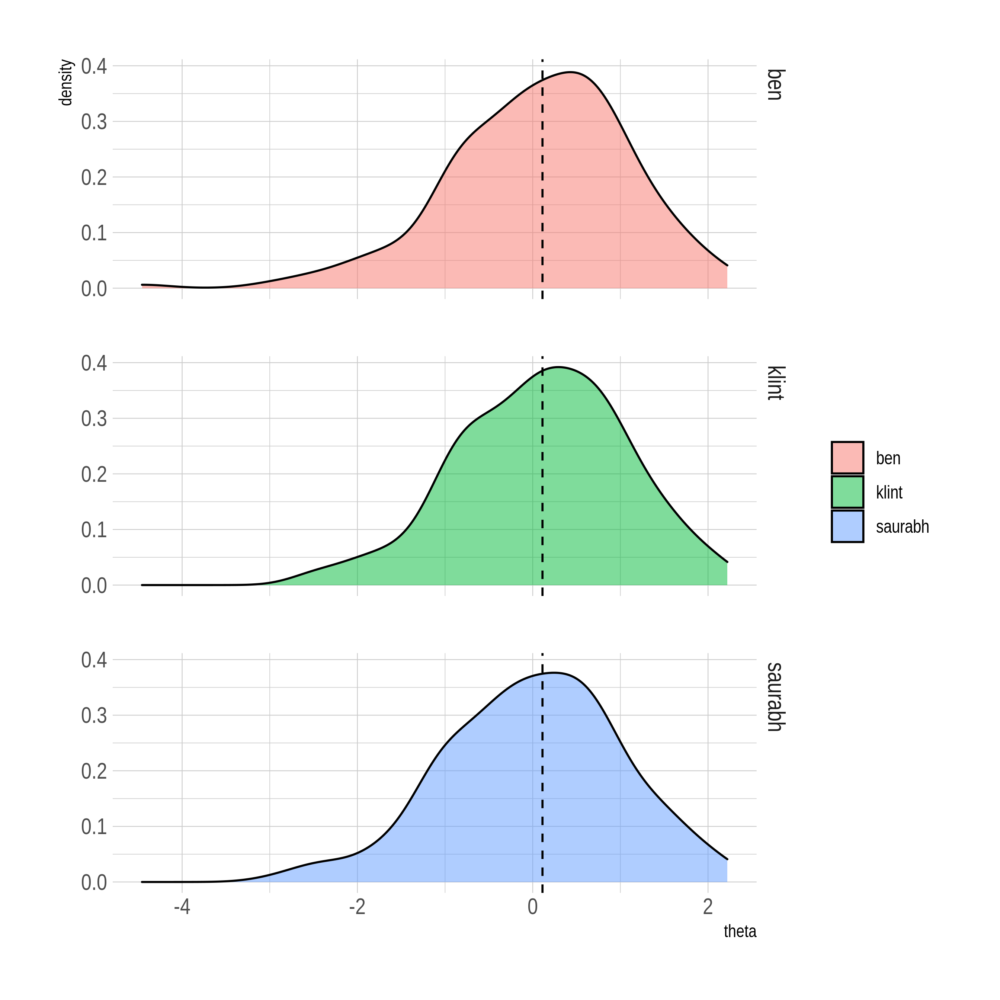

Network Equating Trials
================
2021-07-11

-   [Graph](#graph)
-   [Stochastic adjacency matrix](#stochastic-adjacency-matrix)
-   [Left eigen-vector with eigenvalue
    1](#left-eigen-vector-with-eigenvalue-1)
-   [Thetas and Comparison](#thetas-and-comparison)

### Graph

``` r
nodes <-
  df %>% 
  count(t1, t2) %>% 
  pivot_longer(cols = -n) %>% 
  distinct(value) %>%
  arrange(value)

edges <-
  df %>% 
  count(t1, t2, name = "weight")

G <-
  graph_from_data_frame(edges, nodes, directed = FALSE) %>% 
  as_tbl_graph()

G
```

    ## # A tbl_graph: 201 nodes and 9998 edges
    ## #
    ## # An undirected simple graph with 1 component
    ## #
    ## # Node Data: 201 x 1 (active)
    ##   name 
    ##   <chr>
    ## 1 1    
    ## 2 2    
    ## 3 3    
    ## 4 4    
    ## 5 5    
    ## 6 6    
    ## # … with 195 more rows
    ## #
    ## # Edge Data: 9,998 x 3
    ##    from    to weight
    ##   <int> <int>  <int>
    ## 1     1     4    117
    ## 2     1     8     34
    ## 3     1     9     69
    ## # … with 9,995 more rows

### Stochastic adjacency matrix

``` r
m <- as_adj(G, attr = "weight", type = "both", sparse = FALSE)
m_scaled <- m/rowSums(m)
```

### Left eigen-vector with eigenvalue 1

``` r
eigen_scaled <- (eigen(t(m_scaled))$vectors)[,1] / sum((eigen(t(m_scaled))$vectors)[,1])
eigen_scaled
```

    ##   [1] 0.004567176 0.004245725 0.004930232 0.005291307 0.005067926 0.004865347
    ##   [7] 0.005830690 0.005438411 0.005302699 0.004808388 0.005265551 0.005684081
    ##  [13] 0.005274962 0.005599384 0.004883178 0.005596908 0.004459695 0.004941128
    ##  [19] 0.004506254 0.005267532 0.005052571 0.004938652 0.004844049 0.004280396
    ##  [25] 0.003966375 0.004629088 0.004555784 0.004827704 0.005669717 0.004673666
    ##  [31] 0.005358668 0.004594417 0.004113480 0.004588474 0.004312591 0.003714266
    ##  [37] 0.004339832 0.005359658 0.005007004 0.004669208 0.004837115 0.005289325
    ##  [43] 0.004784118 0.005668231 0.004703879 0.004449294 0.004789071 0.005482988
    ##  [49] 0.004797986 0.005278924 0.004584016 0.004836125 0.005117456 0.005068421
    ##  [55] 0.005422066 0.004336861 0.004445332 0.005478035 0.005296260 0.004805416
    ##  [61] 0.005241777 0.005513697 0.005031769 0.006102611 0.004806406 0.004661778
    ##  [67] 0.004510711 0.005698445 0.005501315 0.004965894 0.004157561 0.005313595
    ##  [73] 0.005615729 0.004575101 0.004678123 0.005682595 0.004896551 0.005491408
    ##  [79] 0.005623654 0.004691001 0.004849993 0.005067430 0.005150641 0.004412146
    ##  [85] 0.004678619 0.004193223 0.004438893 0.005427019 0.004416109 0.005069412
    ##  [91] 0.005007004 0.005193732 0.004722205 0.004845040 0.004705860 0.005719743
    ##  [97] 0.004249192 0.005158071 0.005606814 0.005173425 0.004770249 0.004451771
    ## [103] 0.005338360 0.005109531 0.005032264 0.005413151 0.005433458 0.005088728
    ## [109] 0.004379952 0.005496362 0.004477526 0.004394316 0.005058020 0.005379470
    ## [115] 0.005457233 0.005520136 0.005642475 0.004759848 0.005435935 0.004080294
    ## [121] 0.004991649 0.004799472 0.004903486 0.004719233 0.005324492 0.005354210
    ## [127] 0.005671698 0.004821761 0.005215526 0.005180359 0.004647910 0.006044165
    ## [133] 0.005211563 0.004345776 0.005289821 0.004629584 0.004858908 0.004982734
    ## [139] 0.005053562 0.005063963 0.004529038 0.005143707 0.005144697 0.005677642
    ## [145] 0.005487446 0.004927755 0.004181336 0.005000565 0.004416604 0.004845535
    ## [151] 0.005286849 0.005429001 0.005243262 0.005307652 0.005108540 0.004224427
    ## [157] 0.004747961 0.005123895 0.003878707 0.005259112 0.004816312 0.005235338
    ## [163] 0.004335870 0.004231361 0.004864357 0.005542920 0.005164509 0.004687534
    ## [169] 0.005422562 0.005160547 0.004687534 0.004845535 0.004937166 0.005252673
    ## [175] 0.004999574 0.005052571 0.004675647 0.004167467 0.005221469 0.004739045
    ## [181] 0.004785604 0.004833648 0.005744508 0.005050095 0.004609276 0.005475064
    ## [187] 0.005220974 0.005032759 0.004909429 0.004593922 0.005320529 0.005097644
    ## [193] 0.004445827 0.005365602 0.005170948 0.004645433 0.004959455 0.005134296
    ## [199] 0.005576105 0.004653854 0.004904971

### Thetas and Comparison

``` r
saurabh_thetas <- (mats$delta %*% eigen_scaled)[,1]

saurabh_thetas %>% 
  as_tibble() %>% 
  cbind(est[nrow(est),], theta) %>%
  transmute(
    ben = est[nrow(est),],
    klint = theta,
    saurabh = scale(value) %>% as.vector(),
  ) %>% 
  pivot_longer(cols = c(ben, klint, saurabh), values_to = "theta") %>% 
  ggplot(aes(theta, group = name, fill = name)) +
  geom_density(alpha = 0.5) +
  geom_vline(aes(xintercept = median(theta)), linetype="dashed") +
  facet_grid(vars(name)) +
  hrbrthemes::theme_ipsum() +
  labs(fill = "")
```


